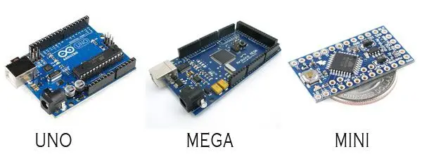

import { Aside } from '@astrojs/starlight/components';
import { Steps } from '@astrojs/starlight/components';

اگه الان اینجایی، احتمالاً یه زمانی به یه وسیله‌ی الکترونیکی نگاه کردی و از خودت پرسیدی:
«این چطور کار می‌کنه؟» یا حتی بهتر از اون: «می‌تونم همچین چیزی بسازم؟»

<Aside type='note' title='آره، می‌تونی!'>

</Aside>

آردوینو یه راه فوق‌العاده برای شروع این مسیر محسوب می‌شه. این یه **پلتفرم عالی برای تمرین و یادگیری**ه؛ هم در برنامه‌نویسی و هم در الکترونیک.
علاوه بر اون، کلی **ساعت سرگرمی و لذت** با پروژه‌های رباتیک و الکترونیک برات می‌سازه (که همیشه هم حال می‌ده 😊).
## آردوینو دقیقاً چیه؟

خیلی‌ها فکر می‌کنن آردوینو فقط «یه برد آبی کوچیک با چندتا قطعه روش». خب، یه جورایی درست می‌گن… ولی تعریف دقیق‌ترش گسترده‌تره.

<Aside type="note">
آردوینو یه **پلتفرم متن‌باز الکترونیک** هست که بر پایه‌ی سخت‌افزار و نرم‌افزار ساده و قابل استفاده ساخته شده.
</Aside>

دقت کن گفتیم «پلتفرم»، نه فقط «برد». چون آردوینو از دو بخش تشکیل شده که باید با هم کار کنن:

1. **سخت‌افزار (بُرد):** بخش فیزیکی، همون برد الکترونیکی که می‌تونی لمسش کنی و روی اون چراغ‌ها، موتور‌ها و سنسورها رو وصل می‌کنیم.
2. **نرم‌افزار (IDE، کتابخانه‌ها، فریمور):** همه‌ی نرم‌افزارهایی که به ما اجازه می‌دن دستورهایی بنویسیم تا برد اون‌ها رو اجرا کنه.

<Aside type="tip">
اینجا یکی از بهترین ویژگی‌های آردوینو خودش رو نشون می‌ده:
تو همزمان **الکترونیک و برنامه‌نویسی** یاد می‌گیری، اون هم در حالی که داری از پروژه ساختن لذت می‌بری 😊.
</Aside>

## میکروکنترلر

اگه به یه برد آردوینو نگاه کنی، یه چیپ سیاه کشیده (یا تو بعضی نسخه‌ها یه مربع کوچیک) با تعداد زیادی پایه می‌بینی.

<Aside type="caution">
اون چیپ همون **میکروکنترلر** هست و در واقع **مغز آردوینو** محسوب می‌شه.
</Aside>

میکروکنترلر در اصل **یه کامپیوتر کوچیکه که داخل یه چیپ قرار گرفته**. البته برخلاف کامپیوتر یا گوشی‌ات، این یکی خیلی (خیلی!) ضعیف‌تره.
اما در عوض، میکروکنترلر **ورودی‌هایی برای دریافت اطلاعات از محیط** (سنسورها) و **خروجی‌هایی برای انجام عمل‌ها** (عملگرها، موتور‌ها و ...) داره.  
همه‌ی این کارها هم طبق برنامه‌ای انجام می‌شه که از طریق کامپیوتر روی اون می‌ریزیم و بعد خودش به‌صورت مستقل اجراش می‌کنه.

<Steps>

1. **ورودی‌ها:** میکروکنترلر دنیا رو «می‌خونه».  
   آیا دکمه‌ای فشار داده شده؟ هوا گرمه؟ نور زیاده؟

2. **پردازش:** طبق دستورهایی که بهش دادیم (کدی که نوشتیم) تصمیم می‌گیره چی کار کنه.  
   «اگر هوا گرم بود، پس…»

3. **خروجی‌ها:** روی دنیای واقعی یه عملی انجام می‌ده.  
   مثلاً یه فن رو روشن می‌کنه، یه موتور رو حرکت می‌ده یا یه LED رو روشن می‌کنه.

</Steps>

برای شروع کار با آردوینو، طبیعتاً **اولین کاری که باید بکنیم خریدن یه بُرده**. برای همین الان می‌خوایم مدل‌های مختلفی که وجود دارن رو ببینیم.

## چه مدل آردوینویی بخرم؟

با اینکه ده‌ها برد رسمی و مدل مختلف وجود داره، برای شروع **الکی پیچیده‌اش نکن**. انتخاب معمولاً بین سه مدل «کلاسیک»ه که ۹۹٪ نیازهای مبتدی‌ها رو پوشش می‌دن:

| مُدل‌ها | پایه‌ دیجیتال | پایه‌آنالوگ | PWM | UART | حافظه | قیمت |
| --- | --- | --- | --- | --- | --- | --- |
| Uno R3 | 16 | 6 | 6 | 1 | 32kb | کم |
| Nano V3 | 14 | 8 | 6 | 1 | 32kb | کمتر |
| Mega R3 | 54 | 16 | 14 | 4 | 256kb | متوسط |
| Mini 05 | 14 | 6 | 8 | 1 | 32kb | خیلی کم |

- **Arduino UNO:** این **مدل استاندارد**ه. اندازه‌ی مناسبی برای کار با دست داره، مقاومه و با بیشتر لوازم جانبی (Shields) سازگاره.
- **Arduino Nano:** در اصل یه Arduino UNO **کوچیک‌شده** است. تقریباً همون قدرت رو داره ولی اندازه‌اش خیلی کوچیکه و برای وصل کردن مستقیم روی بردبورد عالیه.
- **Arduino MEGA:** هیولا! بزرگ‌تره، حافظه‌ی بیشتری داره و ورودی و خروجی‌های خیلی بیشتری ارائه می‌ده. معمولاً تو پروژه‌های بزرگ مثل پرینتر سه‌بعدی یا ربات‌های پیچیده استفاده می‌شه.

برای شروع، **یه Arduino UNO بخرید** (مدل `R3` یا `R4`). این برد بیشترین مستندات دنیا رو داره، اتصالش ساده‌تره و معمولاً بدون دردسر کار می‌کنه.

- **Nano** رو بذار برای وقتی که می‌خوای یه مونتاژ نهایی کوچیک بسازی.
- **Mega** رو هم فقط وقتی لازم داری که پروژه‌ات واقعاً از نظر تعداد پایه کم بیاره (که معمولاً مدتی طول می‌کشه تا به اونجا برسی).

<Aside title="فقط برای پروژه‌های کوچک؟">

آردوینو انعطاف‌پذیر و قابل اعتماده. پس چرا گفتیم بیشتر برای پروژه‌های کوچک؟ چرا برای کاربردهای تجاری یا صنعتی نه؟

جواب کوتاه اینه که در **محیط‌های صنعتی، مسئله‌ی پایداری و قابل تکیه بودن خیلی مهمه**. اگر قرار باشه یه دستگاه خیلی گرون در کارخانه کنترل بشه، معمولاً از تجهیزات صنعتی استفاده می‌کنن که در برابر نویز الکتریکی (و ضربه‌ها) مقاوم باشن و پشتشون هم پشتیبانی فنی رسمی وجود داشته باشه.

اما این **به این معنی نیست که یاد گرفتن آردوینو فقط یه سرگرمیه**. هر چیزی که اینجا درباره‌ی الکترونیک، اتوماسیون، برنامه‌نویسی و مخابرات یاد بگیری، بعداً می‌تونی مستقیم تو کار با کنترلرهای صنعتی حرفه‌ای هم ازش استفاده کنی.

</Aside>
