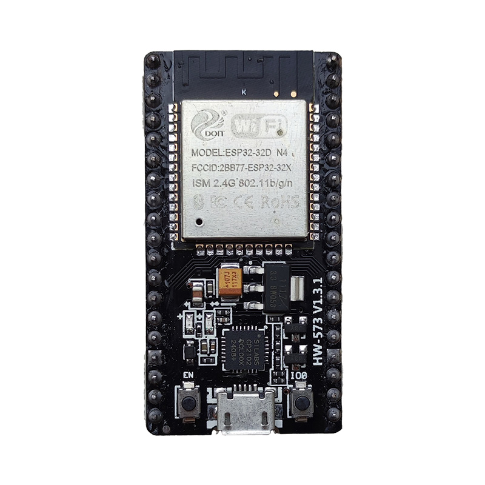
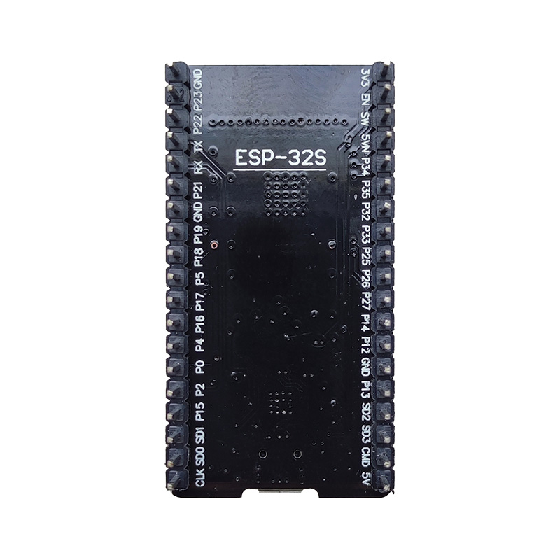
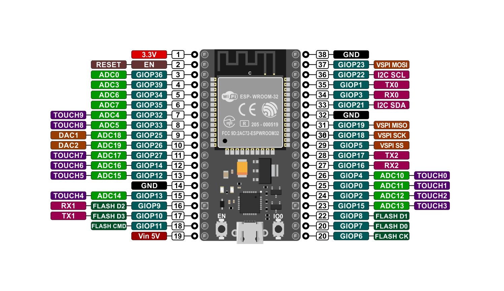

import product01 from '../assets/products/nodemcu-32s+cable.json';

import { Aside } from '@astrojs/starlight/components';
import { Tabs, TabItem } from '@astrojs/starlight/components';
import { LinkButton } from '@astrojs/starlight/components';
import { LinkCard } from '@astrojs/starlight/components';

NodeMCU-32S یک برد توسعه مبتنی بر `ESP32` است که از میکروکنترلر دو هسته‌ای `Xtensa LX6` استفاده می‌کند. این برد دارای اتصال WiFi و Bluetooth داخلی بوده و برای پروژه‌های اینترنت اشیا (IoT) بسیار پرکاربرد است.

نسخه 38 پین این برد، تعداد بیشتری GPIO نسبت به نسخه‌های کوچک‌تر ارائه می‌دهد و امکان استفاده همزمان از رابط‌های متعدد مانند `SPI`، `I2C`، `UART` و `ADC` را فراهم می‌کند.

<Aside type="note">
ESP32 توسط شرکت `Espressif Systems` توسعه داده شده و به دلیل قدرت پردازشی بالا و مصرف انرژی پایین، یکی از محبوب‌ترین چیپ‌های IoT محسوب می‌شود.
</Aside>

<Aside type="tip">
NodeMCU-32S معمولاً از چیپ USB-to-Serial مدل `CP2102` یا `CH340` استفاده می‌کند.
</Aside>

## تصاویر
<Tabs>
  <TabItem label="نمای روبرو">
    
    *نمای روبروی برد NodeMCU-32S*
  </TabItem>
  <TabItem label="نمای پشت">
    
    *نمای پشت برد NodeMCU-32S*
  </TabItem>
  <TabItem label="نقشه پایه ها">
    
  </TabItem>
</Tabs>

## فایل ها

<Tabs>
  <TabItem label="مستندات">
    {/* <LinkButton href="/esp32/nodemcu-32s-pinout.pdf" variant="link" icon='document' iconPlacement='start'>
      نقشه پایه‌ها
    </LinkButton> */}
    <LinkButton href="/esp32/nodemcu-32s-schematics.pdf" variant="link" icon='document' iconPlacement='start'>
      شماتیک مدار
    </LinkButton>
    <LinkButton href="/esp32/nodemcu-32s-datasheet.pdf" variant="link" icon='document' iconPlacement='start'>
      دیتاشیت NodeMCU 32S
    </LinkButton>
    <LinkButton href="/esp32/esp32-wroom-32d_esp32-wroom-32u_datasheet_en.pdf" variant="link" icon='document' iconPlacement='start'>
      دیتاشیت ESP32-WROOM-32D-N4
    </LinkButton>
  </TabItem>

  <TabItem label="درایور">
    <LinkButton href="/drivers/cp210x-win.rar" variant="link" icon='download' iconPlacement='start'>
      درایور CP2102 برای Windows
    </LinkButton>
    {/* <LinkButton href="/drivers/cp2102-linux.zip" variant="link" icon='download' iconPlacement='start'>
      درایور CP2102 برای Linux
    </LinkButton> */}
    <LinkButton href="/drivers/cp2102-mac.dmg" variant="link" icon='download' iconPlacement='start'>
      درایور CP2102 برای macOS
    </LinkButton>
  </TabItem>
</Tabs>

## مشخصات فنی

| مشخصه | مقدار |
|---|---|
| تعداد پایه‌ها | 38 |
| ماژول | ESP32-WROOM-32D-N4 |
| پردازنده | Xtensa® dual-/single core 32-bit LX6 |
| ROM | 448 کیلوبایت |
| RAM | 520 کیلوبایت |
| فلش | QH32BHIG - 4 MB |
| فرکانس کاری | 80 تا 240 مگاهرتز (قابل تنظیم) |
| WiFi | 802.11 b/g/n, 2.4 GHz |
| بلوتوث | BLE 4.2 BR/EDR و BLE (Bluetooth Low Energy) |
| اتصال WiFi | 2.4GHz (حداکثر 150Mbps) |
| رابط USB-Serial | CP2102 |
| آنتن | داخلی |
| کانکتور | Micro USB |
| حالت‌های کاری | STA / AP / STA+AP |
| تعداد GPIO | 32 |
| قابلیت‌های GPIO | PWM، I2C، SPI و ... |
| ولتاژ تغذیه | 4.5 تا 12 ولت DC (پین VIN) |
| سطح ولتاژ منطقی | 3.3 ولت DC |
| جریان مصرف معمول | 80 میلی‌آمپر |
| حداکثر جریان مصرف | 500 میلی‌آمپر |
| پشتیبانی | آپدیت Firmware از راه دور |
| مبدل | آنالوگ به دیجیتال (ADC) |
| سنسور داخلی | دما و سنسور هال |
| رابط‌ها | کارت SD، UART (3 کانال)، SPI (3 کانال)، SDIO، I2C (2 کانال)، I2S (2 کانال)، IR، PWM LED (2 کانال)، PWM موتور (3 کانال) |
| انواع GPIO | ورودی/خروجی دیجیتال (32)، ADC 12 بیت (18 کانال)، DAC 8 بیت (2 کانال)، سنسور خازنی (10 کانال)، LNA پیش‌تقویت‌کننده |
| دمای کاری | -40 تا +85 درجه سانتی‌گراد |
| سازگاری | سازگار با Arduino IDE |
| فاصله بین پین‌ها | 2.54 میلی‌متر |
| ابعاد | 51 × 27.5 × 5 میلی‌متر |
| وزن | 9 گرم |

## راهنمای برنامه‌نویسی

NodeMCU-32S را می‌توان با `Arduino IDE`، `PlatformIO` یا `ESP-IDF` برنامه‌نویسی کرد.

برای Arduino IDE:
- از Board Manager پکیج `ESP32 by Espressif Systems` را نصب کنید.
- برد `ESP32 Dev Module` را انتخاب کنید.

آپلود برنامه از طریق USB و UART (معمولاً CP2102 یا CH340) انجام می‌شود.

## تغذیه

برد از طریق USB با ولتاژ `5V` تغذیه می‌شود و روی برد به `3.3V` تبدیل می‌گردد.

<Aside type="danger">
پایه‌های GPIO در ESP32 تحمل 5V ندارند و فقط با سطح منطقی 3.3V کار می‌کنند. اتصال مستقیم 5V ممکن است باعث آسیب دائمی شود.
</Aside>

پایه‌های تغذیه:
- **VIN / 5V:** ورودی تغذیه از USB یا منبع خارجی
- **3V3:** خروجی رگولاتور
- **GND:** زمین

## حافظه

ESP32 دارای:
- Flash: معمولاً 4MB
- SRAM: حدود 520KB
- RTC Memory برای حالت Deep Sleep

## ورودی و خروجی

پایه‌های GPIO در ESP32 قابلیت‌های متعددی دارند:

- PWM (LEDC)
- ADC 12-bit
- حسگر لمسی
- SPI / I2C / UART

<Aside type="note">
برخی GPIOها (مانند 34 تا 39) فقط ورودی هستند.
</Aside>

## ارتباطات

ESP32 از پروتکل‌های زیر پشتیبانی می‌کند:
- WiFi داخلی
- Bluetooth BLE
- UART
- SPI
- I2C
- CAN (TWAI)

کتابخانه‌های Arduino مانند `WiFi.h` و `BluetoothSerial.h` برای توسعه استفاده می‌شوند.

## حالت Boot و Reset

برد دارای دو حالت اصلی است:
- **Boot mode** برای آپلود firmware
- **Run mode** برای اجرای برنامه

با نگه داشتن دکمه BOOT هنگام ریست، برد وارد حالت فلش می‌شود.

## برد های موجود در بازار ایران

بعضی از بردهای NodeMCU-32S در بازار ایران و چین با نام‌هایی مثل `HW-573` یا بدون برند رسمی `NodeMCU` عرضه می‌شوند. این بردها معمولاً از نظر عملکرد کلی مشابه نسخه اصلی هستند.

## سفارش

<LinkCard
  href={`${product01.link}?utm_source=wiki-derock`}
  title={product01.title}
  description="خرید از فروشگاه کارگاه فناوری دراک"
/>